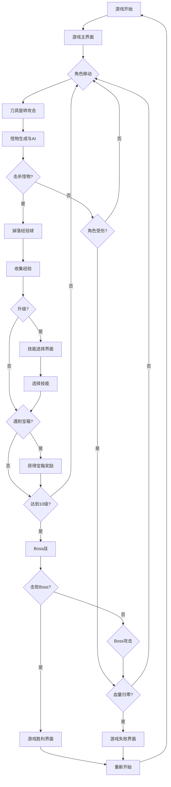

# 转刀游戏产品需求文档

## 1. Product Overview
一款纯前端的2D动作生存游戏，玩家控制角色在地图中移动，通过旋转的刀具击败怪物，收集经验升级并选择技能，最终挑战boss获得胜利。
游戏采用经典的"虚假游戏广告"转刀玩法，提供简单易上手但富有策略性的游戏体验。
支持桌面端和移动端双平台，在移动设备上提供触控友好的操作体验和响应式界面设计。

## 2. Core Features

### 2.1 Feature Module
我们的转刀游戏包含以下主要页面：
1. **游戏主界面**：游戏画布、角色显示、UI界面、控制系统
2. **技能选择界面**：升级时的技能选择弹窗
3. **游戏结束界面**：胜利/失败结果显示、重新开始选项

### 2.2 Page Details

| Page Name | Module Name | Feature description |
|-----------|-------------|---------------------|
| 游戏主界面 | 游戏画布 | 渲染游戏场景、角色、怪物、武器、特效等所有游戏元素 |
| 游戏主界面 | 角色控制 | 响应键盘/鼠标/触控输入，支持WASD键盘控制、虚拟摇杆和触摸移动 |
| 游戏主界面 | 武器系统 | 生成刀具围绕角色旋转，检测碰撞，处理武器消耗和伤害 |
| 游戏主界面 | 怪物系统 | 随机生成怪物，AI寻路攻击玩家，被击败后掉落经验球 |
| 游戏主界面 | 经验系统 | 收集经验球，计算经验值，触发升级 |
| 游戏主界面 | 宝箱系统 | 随机生成宝箱，提供武器、增益效果、刀具数量提升 |
| 游戏主界面 | Boss战系统 | 10级触发boss生成，boss特殊攻击模式和血量 |
| 游戏主界面 | UI显示 | 显示血量、等级、经验条、刀具数量等游戏状态，支持响应式布局 |
| 游戏主界面 | 移动端控制 | 虚拟摇杆控制角色移动，触控友好的UI按钮和手势操作 |
| 游戏主界面 | 设备适配 | 自动检测设备类型，调整画布尺寸和UI布局以适配不同屏幕 |
| 技能选择界面 | 技能选项 | 升级时暂停游戏，显示3个随机技能供玩家选择 |
| 技能选择界面 | 技能效果 | 应用选中技能效果（刀生成速度、转速、回血等） |
| 游戏结束界面 | 结果显示 | 显示胜利/失败状态，游戏统计数据 |
| 游戏结束界面 | 重新开始 | 重置游戏状态，返回初始状态 |

## 3. Core Process

**主要游戏流程：**
1. 玩家进入游戏，角色出现在地图中心
2. 桌面端：使用WASD或方向键控制角色移动；移动端：使用虚拟摇杆或触摸屏幕移动
3. 每隔固定时间自动生成刀具围绕角色旋转
4. 地图随机生成怪物向玩家移动攻击
5. 旋转刀具碰到怪物时击杀怪物，刀具数量-1，怪物掉落经验球
6. 收集经验球积累经验值，达到升级条件时弹出技能选择界面
7. 选择技能后继续游戏，重复步骤3-6
8. 地图随机生成宝箱，玩家接触后获得奖励
9. 达到10级时生成boss，击败boss后游戏胜利
10. 角色血量归零时游戏失败

## 4. User Interface Design

### 4.1 Design Style
- **主色调**：深绿色背景(#2d5016)，金黄色UI元素(#ffd700)
- **次要颜色**：红色血量条(#ff4444)，蓝色经验条(#4444ff)
- **按钮样式**：圆角矩形，3D浮雕效果，桌面端悬停发光，移动端触摸反馈
- **字体**：粗体无衬线字体，桌面端16px/20px，移动端自适应14px-18px
- **布局风格**：响应式布局，桌面端顶部状态栏，移动端底部状态栏，弹窗居中显示
- **图标风格**：像素风格图标，移动端图标尺寸增大便于触控操作
- **触控优化**：按钮最小44px触控区域，虚拟摇杆半透明设计

### 4.2 Page Design Overview

| Page Name | Module Name | UI Elements |
|-----------|-------------|-------------|
| 游戏主界面 | 状态栏 | 顶部显示血量条(红色)、经验条(蓝色)、等级数字、刀具计数器 |
| 游戏主界面 | 游戏画布 | 响应式画布，桌面端800x600px，移动端适配屏幕尺寸，深绿色草地背景 |
| 游戏主界面 | 角色 | 简单的像素风格小人，蓝色衣服，持有武器 |
| 游戏主界面 | 刀具 | 银色刀片图标，围绕角色旋转，发光效果 |
| 游戏主界面 | 怪物 | 红色简单图形，不同大小表示不同类型 |
| 游戏主界面 | 经验球 | 绿色发光小球，收集时有粒子效果 |
| 游戏主界面 | 宝箱 | 金色宝箱图标，闪烁提示效果 |
| 技能选择界面 | 弹窗背景 | 半透明黑色遮罩，中央白色圆角矩形 |
| 技能选择界面 | 技能卡片 | 3个并排卡片，图标+文字描述，悬停高亮 |
| 游戏结束界面 | 结果显示 | 大号文字显示胜利/失败，游戏统计数据 |
| 游戏结束界面 | 重新开始按钮 | 绿色大按钮，居中显示，移动端增大触控区域 |
| 游戏主界面 | 虚拟摇杆 | 移动端左下角半透明圆形摇杆，支持拖拽控制角色移动 |
| 游戏主界面 | 触控反馈 | 移动端触摸时提供震动反馈和视觉反馈效果 |

### 4.3 Responsiveness
游戏采用响应式设计，支持桌面端和移动端双平台：

**桌面端（≥768px）：**
- 固定画布尺寸800x600像素，居中显示
- 键盘WASD/方向键控制，鼠标交互优化
- 顶部状态栏布局，悬停效果

**移动端（<768px）：**
- 画布自适应屏幕宽度，保持16:10比例
- 虚拟摇杆控制，触摸友好的UI设计
- 底部状态栏布局，增大触控区域
- 支持设备方向检测，建议横屏游玩
- 自动隐藏地址栏，最大化游戏区域

**性能优化：**
- 移动端降低粒子效果密度
- 根据设备性能调整帧率和渲染质量
- 触控延迟优化，确保操作响应性