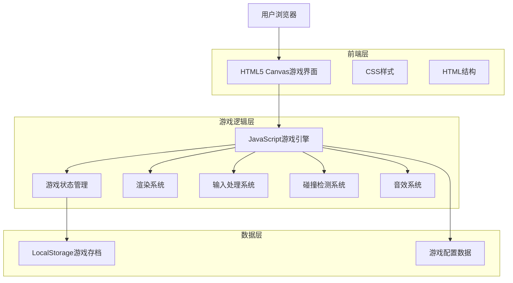
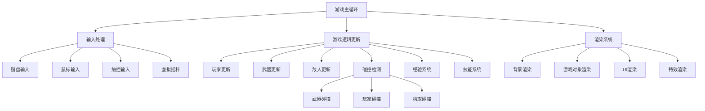

# 转刀游戏技术架构文档

## 1. Architecture design



## 2. Technology Description

* Frontend: HTML5 + CSS3 + Vanilla JavaScript

* 渲染引擎: HTML5 Canvas 2D Context

* 数据存储: LocalStorage (游戏存档)

* 音效: Web Audio API

* 动画: requestAnimationFrame

* 移动端支持: Touch Events API, Vibration API, Screen Orientation API

* 响应式设计: CSS Media Queries, Viewport Meta Tag

* 性能优化: Passive Event Listeners, RAF优化

## 3. Route definitions

| Route | Purpose            |
| ----- | ------------------ |
| /     | 游戏主页面，包含完整的游戏界面和逻辑 |

注：由于是单页面游戏应用，所有功能都在同一个页面中通过JavaScript状态管理实现。

## 4. 核心模块架构

### 4.1 游戏引擎核心

```javascript
// 游戏主循环
class GameEngine {
    constructor()
    update(deltaTime)
    render()
    handleInput()
}

// 游戏状态管理
class GameState {
    currentState // 'playing', 'paused', 'levelUp', 'gameOver', 'victory'
    player
    enemies
    weapons
    experience
    level
}
```

### 4.2 游戏对象系统

```javascript
// 基础游戏对象
class GameObject {
    x, y // 位置
    width, height // 尺寸
    velocity // 速度
    update(deltaTime)
    render(ctx)
}

// 玩家角色
class Player extends GameObject {
    health
    maxHealth
    experience
    level
    moveSpeed
}

// 武器系统
class Weapon extends GameObject {
    damage
    rotationSpeed
    radius
    angle
}

// 敌人系统
class Enemy extends GameObject {
    health
    damage
    moveSpeed
    aiType
}
```

## 5. 文件结构

```
knife_turning/
├── index.html          # 主HTML文件
├── style.css          # 样式文件
└── script.js          # 游戏逻辑文件
```

## 6. 游戏系统架构



## 7. 数据模型

### 7.1 游戏配置数据

```javascript
// 游戏配置
const GameConfig = {
    canvas: {
        desktop: { width: 800, height: 600 },
        mobile: { aspectRatio: 16/10, minWidth: 320 }
    },
    mobile: {
        joystickSize: 80,
        joystickDeadZone: 0.1,
        vibrationEnabled: true,
        touchSensitivity: 1.2
    },
    player: {
        startHealth: 100,
        moveSpeed: 200,
        size: 20
    },
    weapons: {
        baseRotationSpeed: 2,
        baseDamage: 25,
        spawnInterval: 3000,
        maxCount: 8
    },
    enemies: {
        spawnRate: 1000,
        types: [
            { health: 50, damage: 10, speed: 50, exp: 10 },
            { health: 100, damage: 20, speed: 30, exp: 25 }
        ]
    },
    skills: [
        { id: 'weaponSpeed', name: '刀转速增加', effect: 'rotationSpeed', value: 0.5 },
        { id: 'weaponSpawn', name: '刀生成速度', effect: 'spawnRate', value: -500 },
        { id: 'heal', name: '恢复血量', effect: 'health', value: 50 },
        { id: 'moveSpeed', name: '移动速度', effect: 'moveSpeed', value: 50 }
    ]
}
```

### 7.2 游戏状态数据结构

```javascript
// 游戏状态
const gameState = {
    isPlaying: false,
    isPaused: false,
    isLevelingUp: false,
    isGameOver: false,
    
    player: {
        x: 400,
        y: 300,
        health: 100,
        maxHealth: 100,
        experience: 0,
        level: 1,
        moveSpeed: 200
    },
    
    weapons: [],
    enemies: [],
    experienceOrbs: [],
    treasureBoxes: [],
    
    stats: {
        weaponRotationSpeed: 2,
        weaponSpawnRate: 3000,
        lastWeaponSpawn: 0,
        enemySpawnRate: 1000,
        lastEnemySpawn: 0
    }
}
```

### 7.3 本地存储数据

```javascript
// LocalStorage存储的游戏数据
const SaveData = {
    highScore: 0,
    gamesPlayed: 0,
    totalKills: 0,
    bestLevel: 0,
    settings: {
        soundEnabled: true,
        musicEnabled: true
    }
}
```

## 8. 核心算法

### 8.1 碰撞检测算法

```javascript
// 圆形碰撞检测
function circleCollision(obj1, obj2) {
    const dx = obj1.x - obj2.x;
    const dy = obj1.y - obj2.y;
    const distance = Math.sqrt(dx * dx + dy * dy);
    return distance < (obj1.radius + obj2.radius);
}
```

### 8.2 武器旋转算法

```javascript
// 武器围绕玩家旋转
function updateWeaponPosition(weapon, player, deltaTime) {
    weapon.angle += weapon.rotationSpeed * deltaTime;
    weapon.x = player.x + Math.cos(weapon.angle) * weapon.radius;
    weapon.y = player.y + Math.sin(weapon.angle) * weapon.radius;
}
```

### 8.3 敌人AI寻路

```javascript
// 简单的追踪AI
function updateEnemyAI(enemy, player, deltaTime) {
    const dx = player.x - enemy.x;
    const dy = player.y - enemy.y;
    const distance = Math.sqrt(dx * dx + dy * dy);
    
    if (distance > 0) {
        enemy.x += (dx / distance) * enemy.moveSpeed * deltaTime;
        enemy.y += (dy / distance) * enemy.moveSpeed * deltaTime;
    }
}
```

## 9. 移动端技术实现

### 9.1 设备检测与适配

```javascript
// 设备类型检测
class DeviceDetector {
    static isMobile() {
        return /Android|webOS|iPhone|iPad|iPod|BlackBerry|IEMobile|Opera Mini/i.test(navigator.userAgent);
    }
    
    static isTouchDevice() {
        return 'ontouchstart' in window || navigator.maxTouchPoints > 0;
    }
    
    static getScreenSize() {
        return {
            width: window.innerWidth,
            height: window.innerHeight
        };
    }
}
```

### 9.2 虚拟摇杆实现

```javascript
// 虚拟摇杆控制器
class VirtualJoystick {
    constructor(canvas, config) {
        this.canvas = canvas;
        this.size = config.joystickSize;
        this.deadZone = config.joystickDeadZone;
        this.isActive = false;
        this.centerX = 0;
        this.centerY = 0;
        this.knobX = 0;
        this.knobY = 0;
    }
    
    handleTouchStart(touch) {
        // 处理触摸开始事件
    }
    
    handleTouchMove(touch) {
        // 处理触摸移动事件
    }
    
    getDirection() {
        // 返回摇杆方向向量
        return { x: this.deltaX, y: this.deltaY };
    }
}
```

### 9.3 触控事件处理

```javascript
// 触控输入管理器
class TouchInputManager {
    constructor(canvas) {
        this.canvas = canvas;
        this.touches = new Map();
        this.setupEventListeners();
    }
    
    setupEventListeners() {
        // 使用passive事件监听器优化性能
        this.canvas.addEventListener('touchstart', this.handleTouchStart.bind(this), { passive: false });
        this.canvas.addEventListener('touchmove', this.handleTouchMove.bind(this), { passive: false });
        this.canvas.addEventListener('touchend', this.handleTouchEnd.bind(this), { passive: false });
    }
    
    handleTouchStart(event) {
        event.preventDefault(); // 防止页面滚动
        // 处理多点触控
    }
}
```

### 9.4 响应式画布适配

```javascript
// 画布尺寸适配器
class CanvasAdapter {
    static resizeCanvas(canvas, isMobile) {
        if (isMobile) {
            const screenWidth = window.innerWidth;
            const screenHeight = window.innerHeight;
            const aspectRatio = 16 / 10;
            
            let canvasWidth = screenWidth;
            let canvasHeight = screenWidth / aspectRatio;
            
            if (canvasHeight > screenHeight * 0.8) {
                canvasHeight = screenHeight * 0.8;
                canvasWidth = canvasHeight * aspectRatio;
            }
            
            canvas.width = canvasWidth;
            canvas.height = canvasHeight;
        } else {
            canvas.width = 800;
            canvas.height = 600;
        }
    }
}
```

### 9.5 性能优化策略

```javascript
// 移动端性能优化管理器
class MobilePerformanceManager {
    static getOptimalSettings(deviceInfo) {
        const settings = {
            particleDensity: 1.0,
            shadowQuality: 'high',
            effectsEnabled: true
        };
        
        // 根据设备性能调整设置
        if (deviceInfo.isLowEnd) {
            settings.particleDensity = 0.5;
            settings.shadowQuality = 'low';
            settings.effectsEnabled = false;
        }
        
        return settings;
    }
    
    static enableVibration(pattern) {
        if ('vibrate' in navigator) {
            navigator.vibrate(pattern);
        }
    }
}
```

